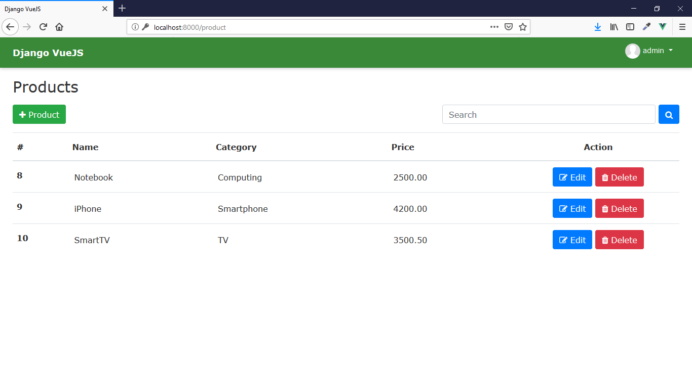

# Products

Project of an products registration using Python with Django and VueJS.

## Features

- CRUD
- Active Record
- API RestFul
- Login
- Search
- Paginate
- Routes
- Migrate
- Responsive

## Requirements

- Python >= 3.7.0
- Django >= 2.1.2
- PIP >= 18.0

## Tecnologies

- Python
- Django
- CSS and SCSS
- Jquery
- VueJS
- Bootstrap
- SQLite

## Installation

```
$ git clone https://github.com/danilomeneghel/vuejs-python-django.git

$ cd vuejs-python-django
```

Download and install Python 3: 

https://www.python.org/downloads/

PS: Set the environment variable pointing to the path of the Python installation.


Download and install PIP:

https://pip.pypa.io/en/stable/installing/

```
$ curl https://bootstrap.pypa.io/get-pip.py -o get-pip.py
$ python get-pip.py
$ python -m pip install -U pip
```

After install the file requirements:

```
$ pip install -r requirements.txt
```

After everything is done, migrate datable and run the project:

```
$ python manage.py migrate
$ python manage.py runserver
```

Finally open http://localhost:8000/ in your browser.

## Create new modules

```
$ python manage.py startapp name_module
```

## Routes

```
$ python manage.py show_urls
```

## Demonstration

You can see the system working by clicking the link below:<br>
https://vuejs-python-django.herokuapp.com/

- Login:
    - Username: admin
    - Password: admin

## License

This project is licensed under <a href="LICENSE">The MIT License (MIT)</a>.

## Screenshots

<br><br>
<br><br>
<br><br>
<br><br>
<br><br>


Developed by<br>
Danilo Meneghel<br>
danilo.meneghel@gmail.com<br>
http://danilomeneghel.github.io/<br>
